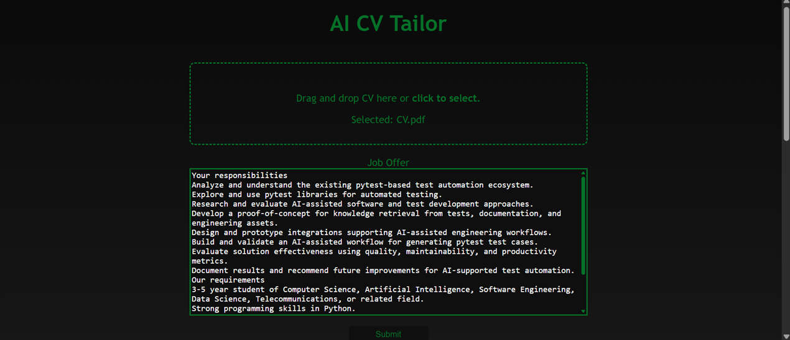
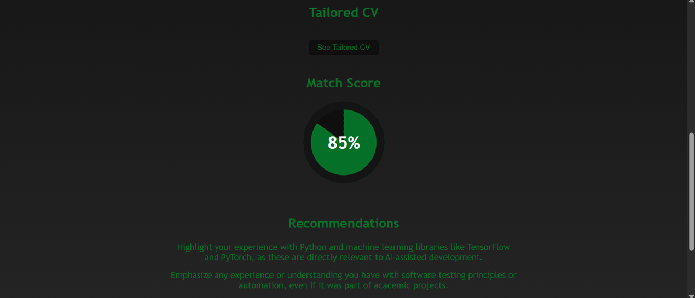

# CV AI Tailor

## Overview
CV AI Tailor is a web application designed to automatically optimize and tailor CVs to specific job descriptions using LLMs. The application analyzes an uploaded CV against a job offer, calculates a compatibility match score, generates targeted recommendations, and provides a tailored CV in PDF format.

---

## Visuals

### Application Dashboard


### Analysis Results


---

## Tech Stack

### Frontend
* HTML5
* CSS3
* JavaScript (Vanilla ES6+)

### Backend
* Python 3.10+
* FastAPI
* Uvicorn
* LangChain / Google GenAI (`gemini-2.5-flash-lite` / `gemini-2.5-flash`)

### DevOps & Tools
* Docker & Docker Compose
* Pytest & Pytest-Cov
* Ruff
* GitHub Actions, Python Coverage Comment Action, GitHub Step Summary

---

## Key Features
* Drag-and-drop PDF CV upload interface
* Automated job description analysis
* Match score visualization
* Actionable improvement recommendations
* Direct PDF preview in a new tab

---

## Getting Started

### Prerequisites
* Python 3.10 or higher
* Google Gemini API Key
* Docker & Docker Compose installed

---

### Installation and Setup

1. **Clone the Repository**
   ```bash
   git clone https://github.com/MrWlobo/AI_CV_Tailor.git
   cd AI_CV_Tailor
   ```

2. **Environment Configuration**<br>
   Create a `.env` file in the root directory:
   ```env
   GEMINI_API_KEY=your_gemini_api_key
   ```

3. **Run with Docker Compose**<br>
   Start both backend and frontend containers:
   ```bash
   docker compose up --build
   ```

   Once the containers are running:
   * **Frontend:** Access at `http://localhost:8080`
   * **Backend API:** Access at `http://localhost:8000`

---

## Usage Guide
1. Drag and drop your CV (PDF format) into the designated upload area or click to select the file.
2. Paste the target job description into the text area.
3. Click the submit button to begin analysis.
4. Review your match score and recommendations once generated.
5. Click the button to view and download your tailored CV.

---

## Project Structure
```text
.
├── src/
│   ├── backend/
│   │   ├── __init__.py
│   │   ├── api.py
│   │   ├── Dockerfile
│   │   ├── llm_integration.py
│   │   └── prompt.py
│   ├── frontend/
│   │   ├── Dockerfile
│   │   ├── index.html
│   │   ├── script.js
│   │   └── style.css
│   └── __init__.py
├── tests/
│   ├── backend_tests/
│   └── conftest.py
├── .dockerignore
├── .env
├── .gitignore
├── .python-version
├── docker-compose.yml
├── pyproject.toml
├── README.md
└── uv.lock
```
